# 🇮🇹 Bilanci Armonizzati RAG Chatbot 🤖

A multilingual RAG-based (Retrieval Augmented Generation) chatbot for interacting with Italian Harmonized Financial Statements (Bilanci Armonizzati) documents. This application uses advanced NLP techniques to provide accurate responses to queries about Italian local government financial statements.

## 📸 Screenshots

### 1. Chat Bot Interface with Ollama/Groq Integration
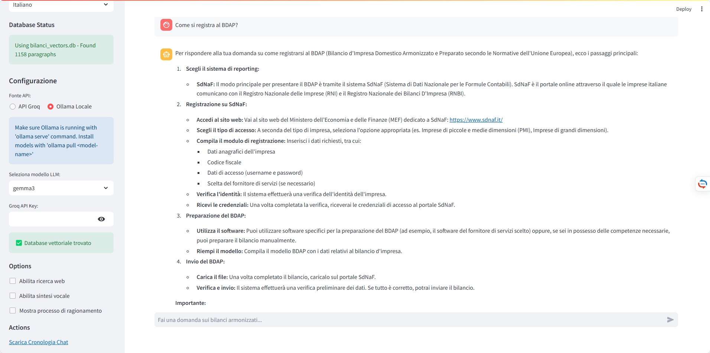

### 2. Checking Reference Documentation
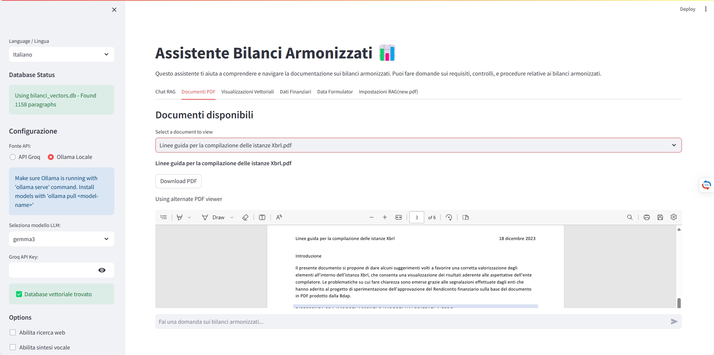

### 3. Document Chunk-wise Embedding Visualization
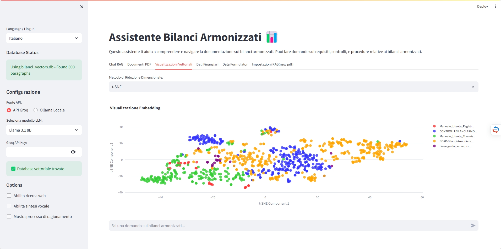

### 4. Fetching Official Financial Data
.png)

### 5. Data Science Visualization Tool Initialization
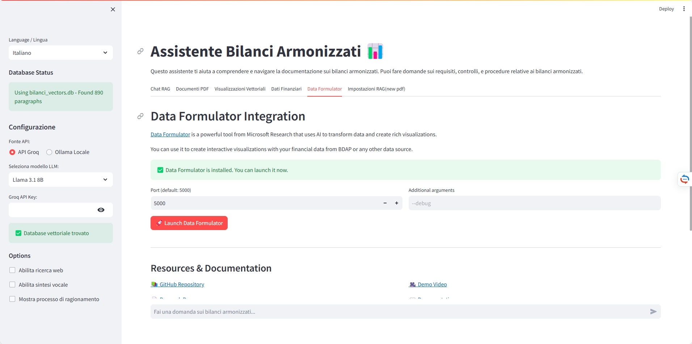

### 6. Document Processing Parameter Settings
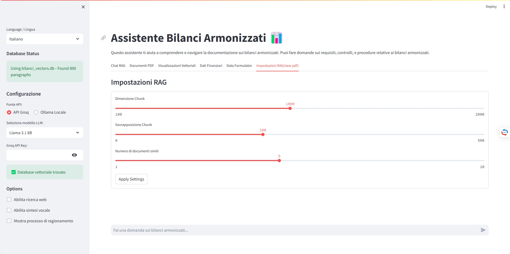

## ✨ Features

- **Multilingual Support**: Full support for both English and Italian
- **RAG Architecture**: Uses vector embeddings to retrieve relevant context before generating responses
- **Multiple LLM Options**: 
  - [Groq](https://groq.com/) API integration with multiple models (Llama 3.1, Gemma2)
  - Local [Ollama](https://ollama.ai/) model support
- **Web Search Integration**: Optional DuckDuckGo search to supplement responses
- **Document Management**: Upload and process PDF documents
- **Vector Visualization**: Interactive 2D visualization of document embeddings
- **BDAP Data Integration**: Access to Italian government financial data via BDAP APIs
- **Voice Response**: Text-to-speech for audible responses
- **PDF Processing Pipeline**: Complete workflow from PDF to vector database

## 📋 Requirements

- Python 3.9+
- Required Python packages (see `requirements.txt`)
- Groq API key (for using Groq models)
- Ollama (for local models)

## 🚀 Installation

1. Clone the repository:
   ```
   git clone https://github.com/learnbydoingwithsteven/rag_chat_with_ds_streamlit.git
   cd rag_chat_with_ds_streamlit
   ```

2. Install the required packages:
   ```
   pip install -r requirements.txt
   ```

3. (Optional) Install UMAP for better visualization:
   ```
   pip install umap-learn
   ```

4. (Optional) Set up Ollama for local models:
   - Follow instructions at [Ollama.ai](https://ollama.ai/)
   - Pull models like: `ollama pull llama3`

## 🔧 Configuration

1. Add your Groq API key to a `.groq_api_key` file in the project root
   ```
   echo "your-api-key-here" > .groq_api_key
   ```

2. (Optional) Set up environment variables:
   ```
   export GROQ_API_KEY=your-api-key
   ```

## 💻 Usage

### Running the Application

1. Start the Streamlit server:
   ```
   streamlit run 2_chatbot_multilingual.py
   ```

2. Access the web interface at `http://localhost:8501`

### PDF Processing Pipeline

The application includes a complete pipeline for processing PDFs:

1. Convert PDFs to text:
   ```
   python 0_pdf_to_text.py
   ```

2. Convert text files to vector embeddings:
   ```
   python 1_text_to_vector_db.py
   ```

3. (Optional) Launch the Streamlit formulator:
   ```
   python launch_data_formulator.py
   ```

## 🧠 How It Works

1. **Document Processing**:
   - PDFs are processed and split into text chunks
   - Text chunks are converted to vector embeddings using SentenceTransformer
   - Embeddings are stored in a SQLite database for fast retrieval

2. **RAG Architecture**:
   - User queries are vectorized and compared to the document vectors
   - Most relevant document chunks are retrieved
   - Retrieved context is passed to the LLM along with the user query

3. **Response Generation**:
   - LLM (either Groq API or local Ollama) generates a response
   - Web search results may be included if enabled
   - Response is presented to the user with citations

## 📊 Vector Visualization

The application includes advanced vector visualization capabilities:

- PCA, t-SNE, and UMAP dimensionality reduction options
- Color-coded document sources for easy identification
- Interactive plots with hover information

## 📊 Data Formulator Demo

The following screenshots illustrate the interactive data visualization dashboards generated by the Data Formulator:

### Screenshot 1
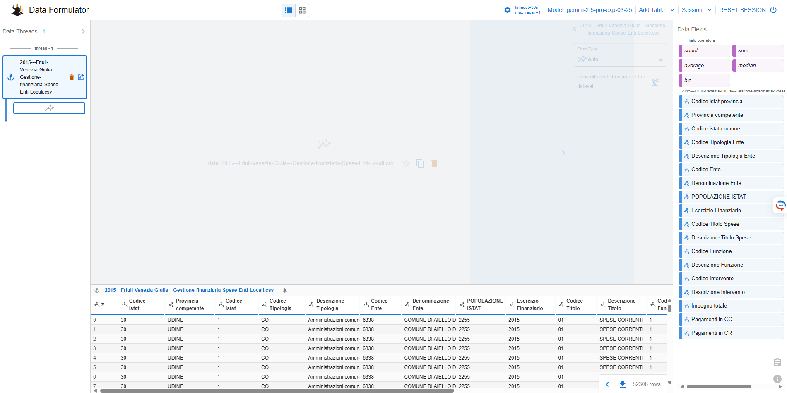
*Dashboard*

### Screenshot 2
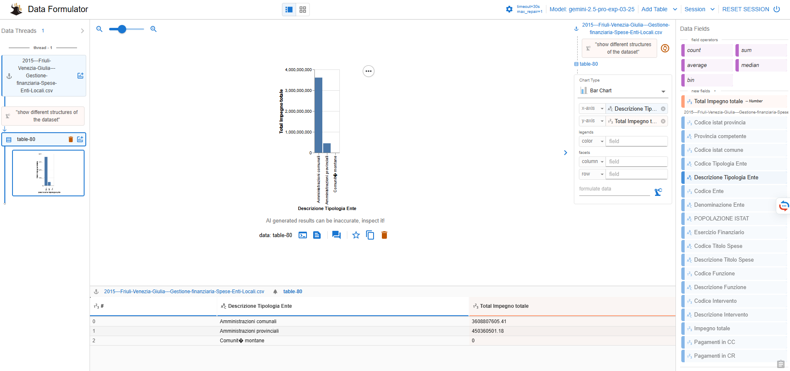
*Dashboard*

### Screenshot 3
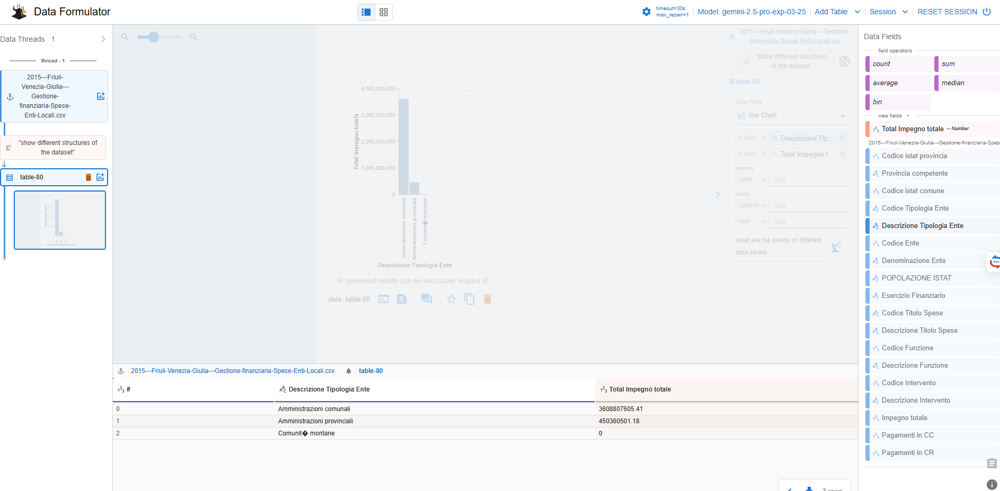
*Dashboard*

### Screenshot 4
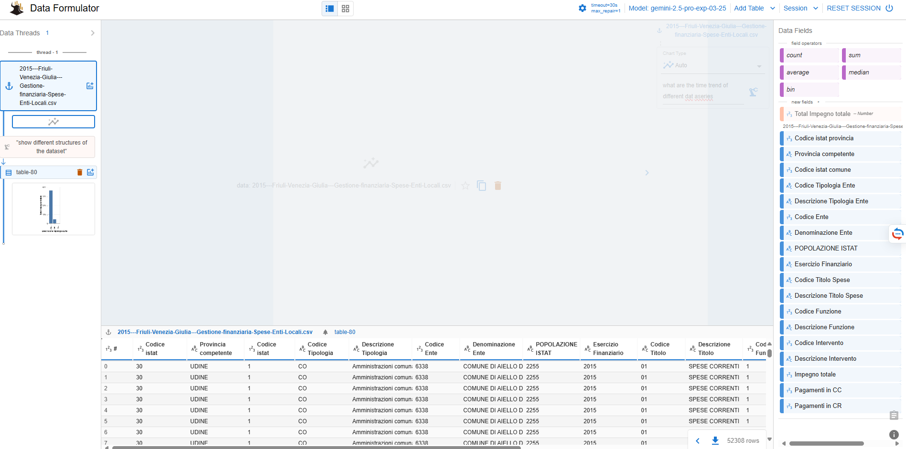
*Dashboard*

### Screenshot 5
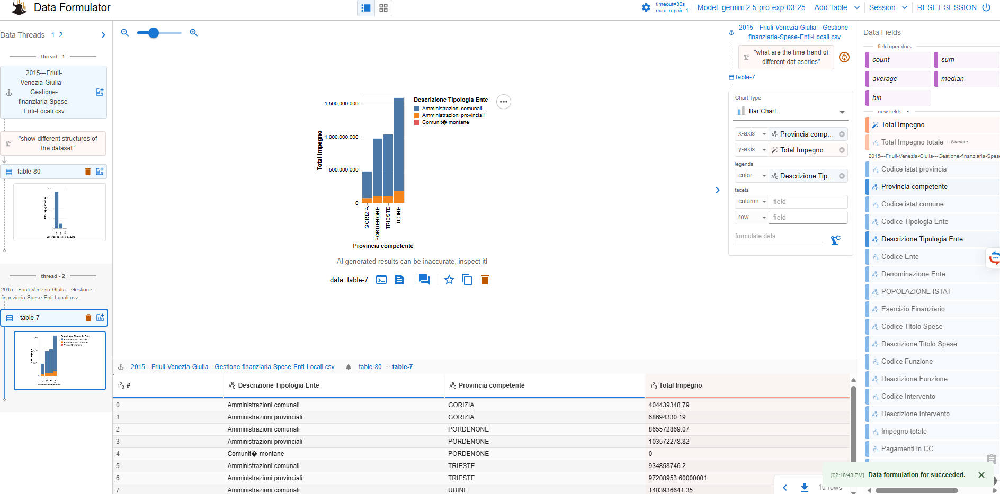
*Dashboard*

### Screenshot 6
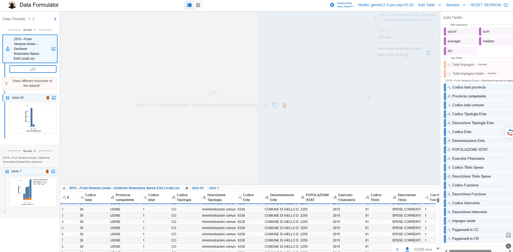
*Dashboard*

### Screenshot 7
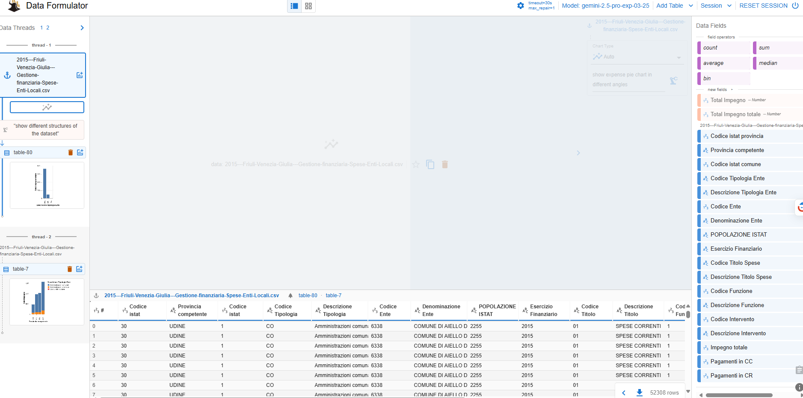
*Dashboard*

### Screenshot 8
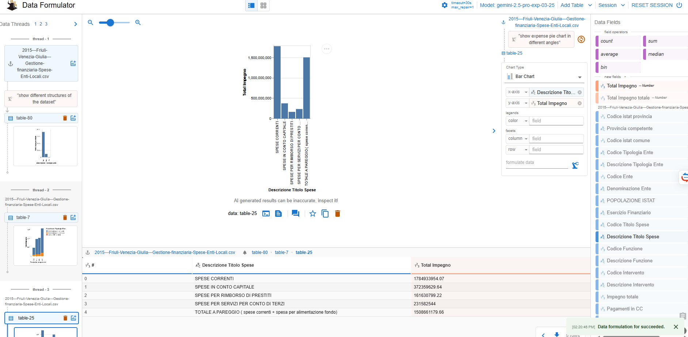
*Dashboard*

### Screenshot 9
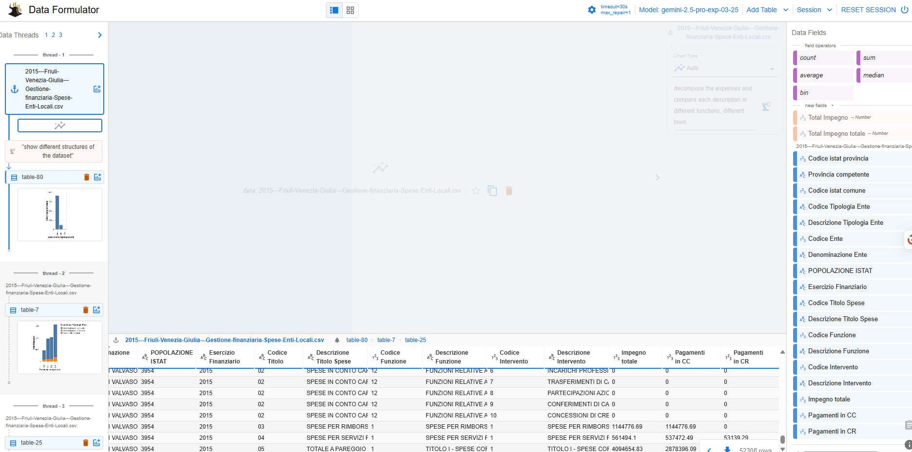
*Dashboard*

### Screenshot 10
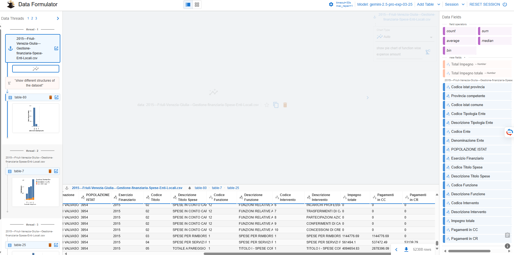
*Dashboard*

### Screenshot 11
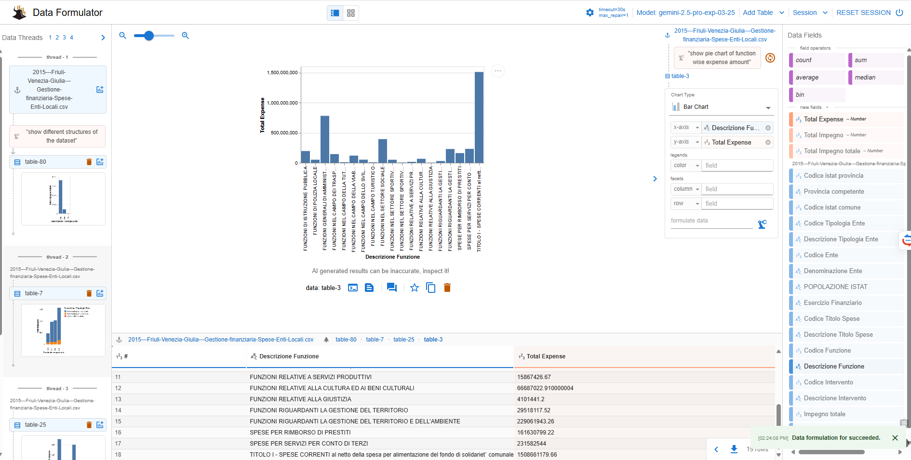
*Dashboard*

### Screenshot 12
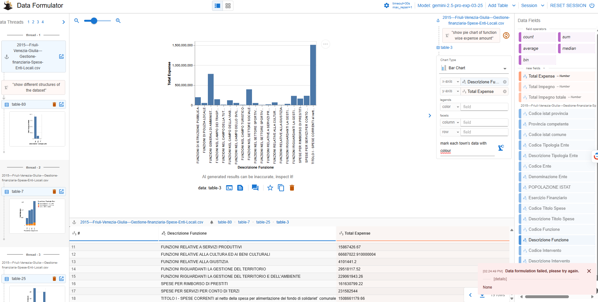
*Dashboard*

### Screenshot 13
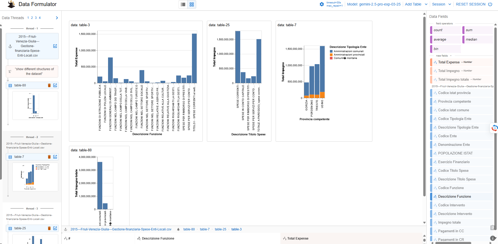
*Dashboard*

## Standalone dashboard


*Preview of the standalone Dash financial dashboard.*

## 🇮🇹 Italian BDAP API Integration

The application integrates with the Italian BDAP (Banca Dati delle Amministrazioni Pubbliche) APIs:

- Access to historical financial data for Italian local governments
- Visualization of financial trends and structures
- CKAN-based API interface for robust data retrieval

## 🤝 Contributing

Contributions are welcome! Please feel free to submit a Pull Request.

## 📜 License

This project is licensed under the Apache License 2.0 - see the [LICENSE](LICENSE) file for details.

## 📧 Contact

For questions or support, please open an issue on GitHub.

## 🙏 Acknowledgments

- [Groq](https://groq.com/) for providing fast LLM API access
- [Ollama](https://ollama.ai/) for local LLM capabilities
- [Streamlit](https://streamlit.io/) for the interactive web interface
- [LangChain](https://langchain.readthedocs.io/) for RAG implementation
- Italian Ministry of Economy and Finance for the BDAP APIs
